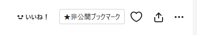

# piixiv 非公開ブクマボタン

Pixiv に非公開ブクマボタンをデフォルトで表示する Chrome 拡張機能です。

- Pixiv の作品ページで「★非公開ブックマーク」ボタンを表示
- ワンクリックで非公開ブックマークに追加可能

## インストール方法

### 1. ファイルのダウンロード
このプロジェクトをダウンロードまたはクローンします。

### 2. Chrome 拡張機能として読み込み
1. Google Chrome を開く
2. アドレスバーに `chrome://extensions/` と入力して Enter を押す
3. 右上にある「デベロッパーモード」をオンにする
4. 「パッケージ化されていない拡張機能を読み込む」をクリック
5. `pixiv-easy-private-bookmarker` フォルダを選択
6. 拡張機能が追加されたことを確認

## 使い方

1. Pixiv の作品ページを開く
2. 「★非公開ブックマーク」ボタンをクリック
3. 非公開ブックマークに追加される

## 対応ブラウザ

- Google Chrome
- その他の Chromium 系ブラウザ（Microsoft Edge 等）

## 注意事項

- この拡張機能は Pixiv の既存機能を利用しているため、Pixiv のサイト構造が変更された場合、動作しなくなる可能性があります
- 非公開ブックマーク機能を使用するには、Pixiv にログインしている必要があります
